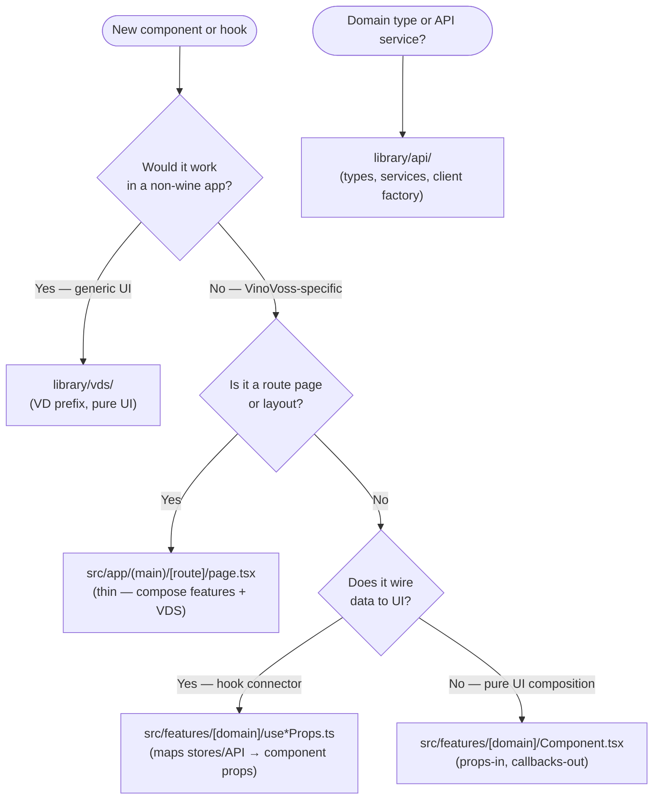

# Project Architecture

VinoVoss uses a **3-layer architecture** (design system → data layer → app). Every file you create or move must fit one of these layers. When in doubt, apply the decision flowchart below.

## When to Use This Skill

- Creating a new component or hook and deciding where it lives
- Moving code between layers (e.g. migrating from legacy `src/components/`)
- Reviewing imports to verify they respect layer boundaries
- Working on the PDP rebuild or any new feature inside `src/features/`

---

## The 3 Layers

| Layer             | Location       | Prefix         | Purpose                                                                                       |
| ----------------- | -------------- | -------------- | --------------------------------------------------------------------------------------------- |
| **Design System** | `library/vds/` | `VD` / `VDNew` | Generic UI primitives. No business logic, no store access, no `@/` imports. Works in any app. |
| **Data Layer**    | `library/api/` | —              | Domain types, API service functions, HTTP client factory. No React.                           |
| **App**           | `src/`         | —              | Everything product-specific: features, stores, hooks, contexts, route pages.                  |

### App sub-layers (inside `src/`)

| Sub-layer          | Location                 | Contains                                                              |
| ------------------ | ------------------------ | --------------------------------------------------------------------- |
| **Features**       | `src/features/[domain]/` | Product UI components, hook connectors (`use*Props.ts`), domain hooks |
| **Global state**   | `src/store/`             | All Zustand stores                                                    |
| **App hooks**      | `src/hooks/`             | Hooks that import from stores, API, contexts, or router               |
| **Route pages**    | `src/app/(main)/`        | Thin pages — compose features + VDS via hook connectors               |
| **Server Actions** | `src/actions/`           | `'use server'` actions only                                           |

---

## Decision Flowchart



---

## Import Rules Per Layer

### `library/vds/` — Design System

- **Allowed:** other `library/vds/` internals, `library/api/src/types/` (for typed props only)
- **Banned:** `@/` imports (anything from `src/`), `library/business-module/`, store access, API calls
- **Rule:** If a component needs a store or makes an API call, it does not belong in VDS.

### `library/api/` — Data Layer

- **Allowed:** `axios`, pure Node.js utilities
- **Banned:** React, `@/` imports, VDS imports
- **Rule:** No JSX, no hooks, no browser globals at module scope.

### `src/features/[domain]/` — Product Features

- **Allowed:** `library/vds/`, `library/api/`, `src/store/`, `src/hooks/`, `src/context/`, `src/utils/`, `src/constants/`, `src/types/`
- **Banned (ESLint-enforced):** `@/components/*`, `@views/*`, `@/modules/ui/*`
- **Rule:** Features must not import from other features (prevents cross-feature coupling).

### `src/app/(main)/` — Route Pages

- **Allowed:** `src/features/`, `library/vds/`, `library/api/`
- **Rule:** Pages are thin — they compose features and VDS, never contain business logic themselves.

---

## `src/features/` Directory Layout

Organized by **domain**, not by route:

```
src/features/
├── wine/
│   ├── WineCard.tsx              # Product component (pure UI, storybooked)
│   ├── WineCard.stories.tsx
│   ├── WineDetailHero.tsx
│   ├── useWineCardProps.ts       # Hook connector
│   ├── useTieredPricing.ts       # Domain logic hook
│   └── useWineCartActions.ts     # Domain logic hook
├── search/
│   ├── SearchAutocomplete.tsx
│   ├── useSearchAutocompleteProps.ts
│   └── useSearchHeroProps.ts
├── navigation/
│   ├── DesktopHeader.tsx
│   ├── MobileHeader.tsx
│   ├── FloatingNavMobile.tsx
│   └── navigation.constants.ts  # Route-aware config (stays in app, not a library)
├── cart/
│   ├── AddToCartFlyOverlay.tsx
│   ├── useCartCardProps.ts
│   └── useCartActions.ts
├── copilot/
│   └── useCopilotWidgetProps.ts
└── favorites/
    └── useFavoriteToggle.ts
```

**Rules for `src/features/`:**

- Product components are pure UI (props + callbacks). They compose VDS primitives in a VinoVoss-specific way.
- Hook connectors map data → component props. All store/API/routing wiring lives here.
- Domain hooks contain business logic (pricing, cart mutations, analytics).
- No cross-feature imports.
- Every product component gets a `.stories.tsx`.
- Max 150 lines per file.

---

## Hook Connector Pattern

This is the **Presentational + Container pattern** adapted for modern React hooks. The component stays pure; the hook wires everything.

```tsx
// src/features/wine/WineCard.tsx — pure UI, props-in/callbacks-out
interface Props {
  title: string
  imageUrl: string
  price: number
  originalPrice?: number
  discountPercentage?: number
  rating: number
  ratingCount: number
  quantity?: number
  isFavorited?: boolean
  onCardClick?: () => void
  onAddToCart?: () => void
  onToggleFavorite?: () => void
  variant?: 'vertical' | 'horizontal' | 'compact'
}

export function WineCard(props: Props) {
  const { title, imageUrl, price, rating, ratingCount, variant } = props

  return (
    <VDCard onClick={props.onCardClick}>
      <VDProductImage src={imageUrl} badge={props.discountPercentage} />
      <VDRating value={rating} count={ratingCount} />
      <VDPriceDisplay price={price} strikethroughPrice={props.originalPrice} />
      <VDButton onClick={props.onAddToCart}>Add to cart</VDButton>
    </VDCard>
  )
}
```

```tsx
// src/features/wine/useWineCardProps.ts — wires stores + API + routing → WineCard props
export function useWineCardProps(wine: IWineSearchItem, options?: { trackingContext?: string }) {
  const router = useRouter()
  const { addToCart, getCartQuantity } = useShoppingCart()
  const { price, originalPrice, discount } = useTieredPricing(wine)
  const { isFavorited, toggleFavorite } = useFavorites(wine.id)

  return {
    title: wine.title,
    imageUrl: wine.imageUrl,
    price,
    originalPrice,
    discountPercentage: discount,
    rating: wine.rating,
    ratingCount: wine.ratingCount,
    quantity: getCartQuantity(wine.id),
    isFavorited,
    onCardClick: () => {
      trackWineClick(wine, options?.trackingContext)
      router.push(`/wine/${wine.slug}/`)
    },
    onAddToCart: () => addToCart(wine),
    onToggleFavorite: toggleFavorite
  }
}
```

---

## Route Pages Are Thin

```tsx
// src/app/(main)/search/page.tsx
import { WineCard } from '@/features/wine/WineCard'
import { useWineCardProps } from '@/features/wine/useWineCardProps'
import { VDContainer } from '@library/vds/src/VDContainer/VDContainer'

// Inline connector component — no business logic in the page itself
function ConnectedWineCard({ wine }: { wine: IWineSearchItem }) {
  const props = useWineCardProps(wine, { trackingContext: 'search' })
  return <WineCard {...props} variant='horizontal' />
}

export default function SearchPage() {
  const { wines } = useSearchResults()
  return (
    <VDContainer>
      {wines.map(wine => (
        <ConnectedWineCard key={wine.id} wine={wine} />
      ))}
    </VDContainer>
  )
}
```

No `_components/` folder needed in most routes. The feature module provides everything.

---

## Naming Conventions

| Rule               | Detail                                                                                            |
| ------------------ | ------------------------------------------------------------------------------------------------- |
| VDS components     | `VD` prefix (e.g. `VDButton`, `VDCard`) or `VDNew` for redesigned variants (e.g. `VDNewCarousel`) |
| Feature components | No prefix (e.g. `WineCard`, `DesktopHeader`)                                                      |
| Hook connectors    | `use*Props` suffix (e.g. `useWineCardProps`, `useCartCardProps`)                                  |
| Domain hooks       | `use` prefix, descriptive (e.g. `useTieredPricing`, `useFavoriteToggle`)                          |
| Props interface    | Always named `Props` (not `WineCardProps`)                                                        |
| Exports            | Named exports only — no `export default` for components                                           |
| Files              | One exported component per file; PascalCase filenames                                             |

---

## Import Path Conventions

| Layer          | Import pattern                             | Example                                                                              |
| -------------- | ------------------------------------------ | ------------------------------------------------------------------------------------ |
| VDS            | `@library/vds/src/[Component]/[Component]` | `import { VDButton } from '@library/vds/src/VDButton/VDButton'`                      |
| API types      | `@vinovoss-web/api/src/types/[file]`       | `import type { IWineSearchItem } from '@vinovoss-web/api/src/types/wineSearchTypes'` |
| Features       | `@/features/[domain]/[File]`               | `import { WineCard } from '@/features/wine/WineCard'`                                |
| Route-relative | `./_components/...` (only when needed)     | `import { SomeShell } from './_components/SomeShell'`                                |

---

## Deprecated Layers

> **Do not add new code to these locations.** They are maintained only for existing `(legacy)` routes and will be progressively eliminated.

| Location                              | Status                                                                                                                                                                                                                    | Migration target                  |
| ------------------------------------- | ------------------------------------------------------------------------------------------------------------------------------------------------------------------------------------------------------------------------- | --------------------------------- |
| `library/business-module/`            | **DEPRECATED** — no new components. Generic UI → `library/vds/` with `VD` prefix. Product UI → `src/features/`. See [#2277](https://github.com/DrinkBetter-AI/vinovoss-frontend/issues/2277) for the redistribution plan. | VDS + `src/features/`             |
| `src/components/`                     | Legacy — `(legacy)` routes only                                                                                                                                                                                           | `library/vds/` or `src/features/` |
| `src/views/`                          | Legacy — `(legacy)` routes only                                                                                                                                                                                           | `src/features/`                   |
| `src/modules/ui/`                     | Legacy — ~50 UI components duplicating VDS intent                                                                                                                                                                         | `library/vds/` or delete          |
| `src/app/(main)/[route]/_components/` | Superseded by `src/features/` domain organization                                                                                                                                                                         | `src/features/[domain]/`          |

---

## References

- [#2277 — PDP Redesign Phase 1 Implementation Plan](https://github.com/DrinkBetter-AI/vinovoss-frontend/issues/2277) — canonical source for the new architecture table and VDS/features split
- [#2140 — Monorepo Library Restructuring (library/api proposal)](https://github.com/DrinkBetter-AI/vinovoss-frontend/issues/2140) — `library/api` design: types, services, HTTP client factory
- [Comment: 3-layer proposal (eliminating business-module)](https://github.com/DrinkBetter-AI/vinovoss-frontend/issues/2140#issuecomment-4164379916) — full rationale for removing `business-module` and the hook-connector pattern
